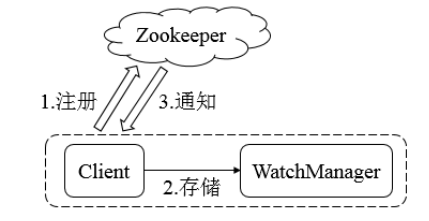

### Zookeeper系统模型
#### Zookeeper数据模型Znode
- 持久性节点(Persistent):也就是一直存在服务器，直到删除操作主动清除。
- 持久顺序节点(Sequential):就是有顺序的持久节点。
- 临时节点(Ephemeral):就是会自动清理掉的节点，生命周期和客户端会话绑在一起，客户端会话结束，节点就会被删除。临时节点不会有子节点。
- 临时顺序节点。
#### 事务ID
- 是指能够改变Zookeeper服务器状态的操作，我们也称之为事务操作或更新操作，一般包括节点创建与删除、数据节点内容更新操作。对于每一个事务请求，Zookeeper都会为其分配一个全局的事务ID，用ZXID表示，一般是64位的数字。每一个ZXID对应一次更新操作。ZXID可以间接地识别Zookeeper处理这些更新操作请求的全局顺序。
#### ZNode的状态信息
###### ZNode节点内容包括两部分:节点的数据的内容和节点状态信息。
- cZxid就是Create zXID,表示节点被创建时的事务ID。
- ctime就是Create Time,表示节点的创建时间。
- mZxid就是Modified zXID,表示节点最后一次被修改的事务ID。
- mtime就是Modified Time,表示最后一次被修改的时间。
- pZxid表示该节点的子节点列表最后一次被修改的事务ID。只有子节点列表变更才会更新pZxid,子节点内容变更不会更新。
- cversion表示子节点的版本号。
- dataVersion表示内容版本。
- aclVersion表示acl版本。
- ephemeralOwner表示创建该临时节点时的会话sessionID,如果是持久性节点那么值为0。
- dataLength表示数据长度。
- numChildren表示直系子节点数。
#### Watcher-数据变更通知
###### 在Zookeeper中，引入了Watcher机制来实现分布式的通知功能。Zookeeper允许客户端向服务端注册一个Watcher监听，当服务端的一些指定事件触发了这个Watcher,那么就会向指定客户端发送一个事件通知来实现分布式的通知功能。Zookeeper的Watcher机制主要包括客户端线程、客户端WatcherManager、Zookeeper服务器三部分。
#### ACL-保障数据的安全
###### Zookeeper的内部存储了分布式系统运行时状态的元数据，这些元数据会直接影响基于Zookeeper进行构造的分布式系统运行状态。
###### 三方面类理解ACL机制:权限模式(Scheme)、授权对象(ID)、权限(Permission),通常使用"scheme:id:permission"来标识一个有效的ACL信息。
- IP模式:就是通过IP地址粒度来进行权限控制。IP模式可以支持按照网段方式进行配置。
- Digest模式:最常用的权限控制模式，要更符合我们对权限控制的认识
- World模式:是一种开放的模式，用户可以不在进行任何权限校验的情况下操作Zookeeper上的数据。
- Super模式:就是一种特殊的Digest模式。在Super模式下，超级用户可以对任意Zookeeper上的数据节点进行任何操作。
#### Zookeeper的命令行操作
```shell
#1.创建顺序节点
create -s /zk-demo 123
#2.创建临时节点
create -e /zk-e 123
#3.创建永久节点
create /zk-permanent 123
#4.更新节点
set /zk-demo 222
```
#### Zookeeper的api的使用

