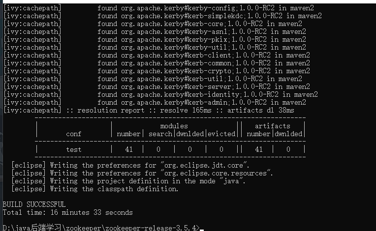

#### zookeeper的源码解析
###### 首先去官网下载源码包[链接](https://github.com/apache/zookeeper/tree/release-3.5.4)
######由于zookeeper源码是apache-ant编译的需要去官网下载ant并配置好环境变量(这里的ant的版本是1.10.6)。准备好后在zookeeper源码包目录下执行ant eclipse进行编译。时间有点长耐心等待。